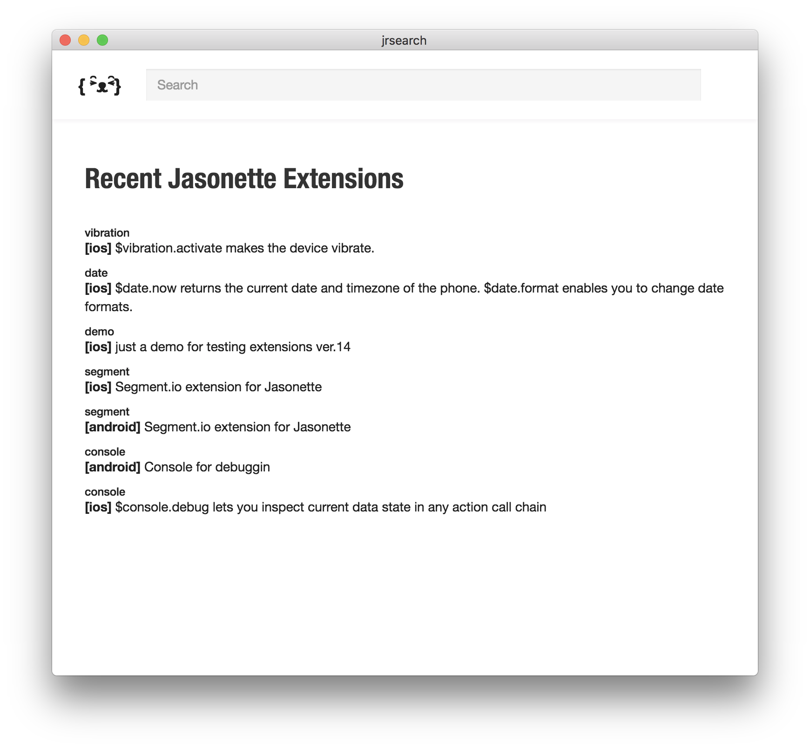

# Jasonette Extension Manager 

An app that makes it easy to integrate [Jasonette extensions](http://docs.jasonette.com/advanced/#extension) into Jasonette projects (for both iOS and Android)

## Usage

1. Clone this repo

2. `npm install`

3. `npm start`

## Note

1. This is pretty much functional for both iOS and Android.
2. But understand that it's still work in progress. There are some bugs that needs fixing, so before you try this out make sure to back up the project.
3. If you run into a problem, please [open an issue](https://github.com/Jasonette/JEM/issues/new).

 

---

**Below this point is for people writing extensions, so you can stop reading if you're just going to use JEM and not writing an extension yourself.**

---

 

## How to add your extensions to the registry

1. Write an extension [following the convention](http://docs.jasonette.com/advanced/#extension)
2. Extract out only the extension-related files from your XCode or Android project and put it into a folder. **Extensions can ONLY contain one class at a time.** Write a separate extension if you want another feature.
3. Also add a config file named `jr.json` in your folder. [Learn how to write jr.json](#jrjson)
4. Push to your Github
5. Go to [http://jasonregistry.netlify.com](http://jasonregistry.netlify.com/) and register your Github repo
6. Open the extension manager and you'll see that your extension has been added!

## jr.json

Your jr.json file must be a JSON file which contains the following attributes:

1. `version`: Follows [semantic versioning](http://semver.org/). Must upgrade everytime you make a change to your repo and wish to update the registry with the latest version.
2. `name`: This is the name that will be used in the JSON. For example if you set this `console` and your main class contains methods named `debug` or `log`, you can call `"type": "$console.debug"` or `"type": "$console.log"` actions in your JSON markup.
3. `description`: This is the description that will show up on the registry list when you open the extension manager
4. `classname`: This is the main class name that will be linked with the `name` attribute above. So if you set the classname attribute as `JasonConsoleAction`, Jasonette will look for `JasonConsoleAction` class every time it runs into the JSON markup specified by the `name` attribute above.
5. `platform`: Specify your platform. Currently can only be `"ios"` or `"android"`
6. `dependencies`: If you're using 3rd party libraries via Cocoapods or gradle, you need to add the lines you would normally use in a `Podfile` (for ios) or a `build.gradle` file (for android). For example: `"dependencies": [ "compile 'com.segment.analytics.android:analytics:4.+'" ]`, or `"dependencies": ["pod 'Analytics', '~> 3.0'"]`

Here are some examples:

- iOS
  - [JasonConsoleAction](https://github.com/gliechtenstein/JasonConsoleAction/blob/master/jr.json)
  - [JasonSegAnalyticsAction](https://github.com/gliechtenstein/JasonSEGAnalyticsAction/blob/master/jr.json)
- Android
  - [JasonConsoleAction-Android](https://github.com/gliechtenstein/JasonConsoleAction-Android/blob/master/jr.json)
  - [JasonSegAnalyticsAction-Android](https://github.com/gliechtenstein/JasonSEGAnalyticsAction-Android/blob/master/jr.json)

## Can't register your extension?

If you can't register your extension at first, try one more time after a minute.
